# mermaid-class

Expert skill for UML class diagrams with beautiful-mermaid.

## When to Use

- "class diagram", "UML", "object model", "inheritance"
- Visualizing code architecture, type hierarchies, object relationships
- Documenting domain models, data structures, or design patterns

## Basic Syntax

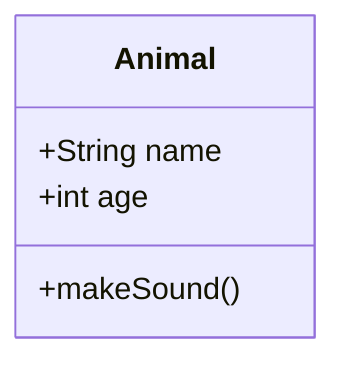

## Class Definition

### Simple Class

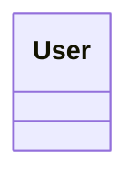

### Class with Members

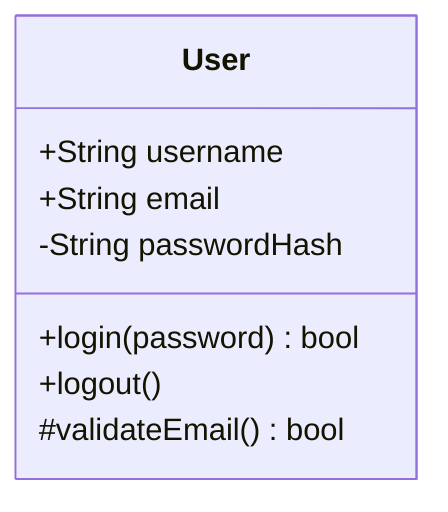

### Generic Types

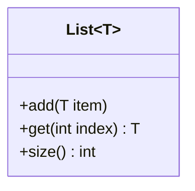

## Visibility Modifiers

| Symbol | Visibility |
|--------|------------|
| `+` | Public |
| `-` | Private |
| `#` | Protected |
| `~` | Package/Internal |

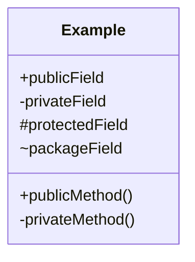

## Member Syntax

### Attributes

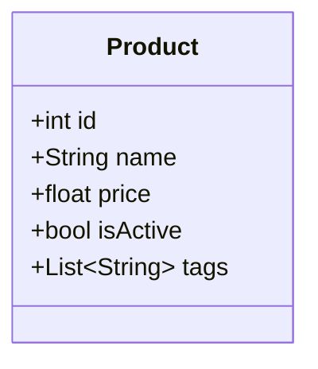

### Methods

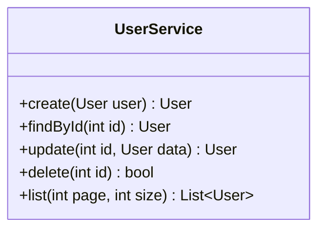

### Static Members

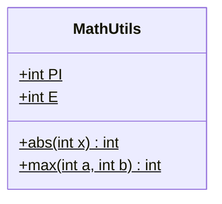

### Abstract Members

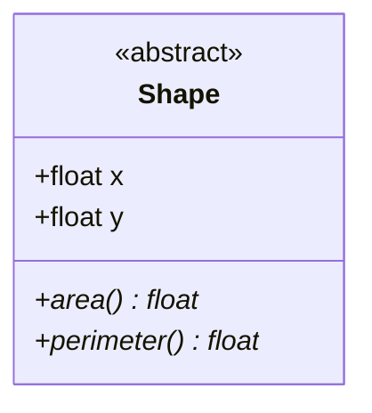

## Class Annotations

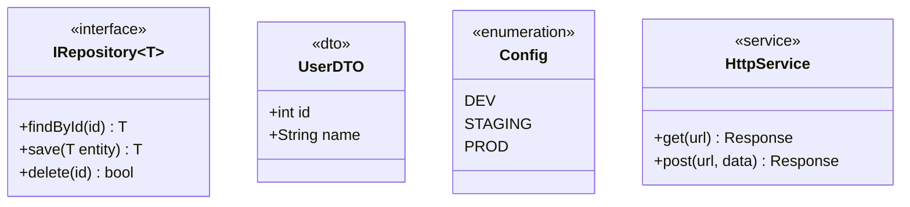

## Relationships

### Inheritance (extends)

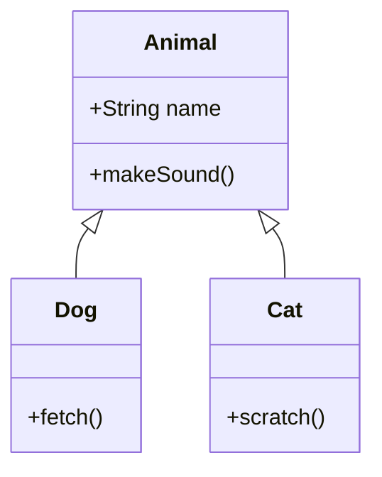

### Implementation (implements)

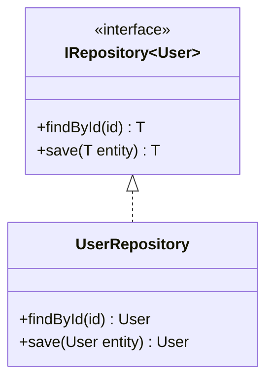

### Composition (strong "has-a")

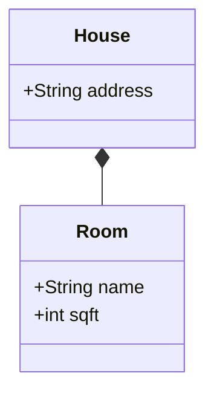

### Aggregation (weak "has-a")

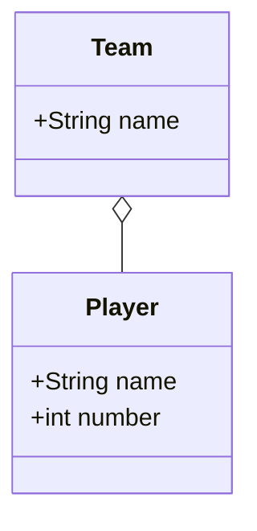

### Association

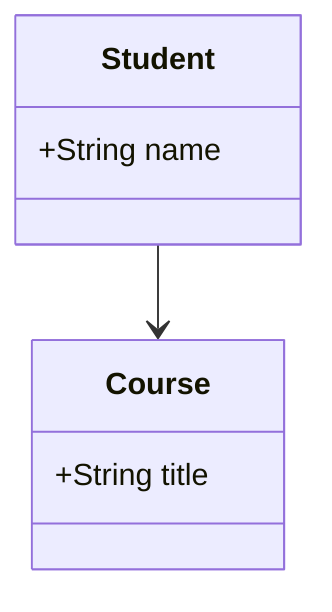

### Dependency

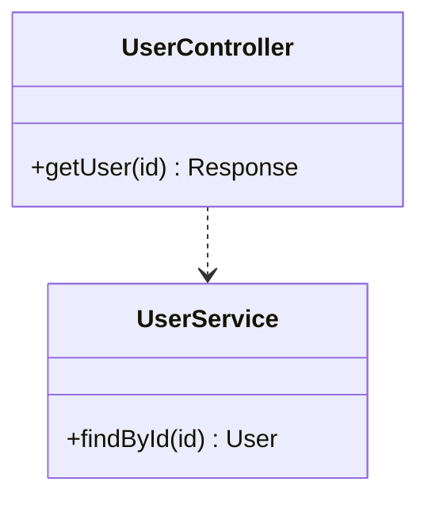

### Relationship Summary

| Syntax | Relationship | Description |
|--------|--------------|-------------|
| `<\|--` | Inheritance | Child extends parent |
| `<\|..` | Realization | Class implements interface |
| `*--` | Composition | Part cannot exist without whole |
| `o--` | Aggregation | Part can exist independently |
| `-->` | Association | Uses/references |
| `..>` | Dependency | Depends on |
| `--` | Link | Simple connection |

## Cardinality

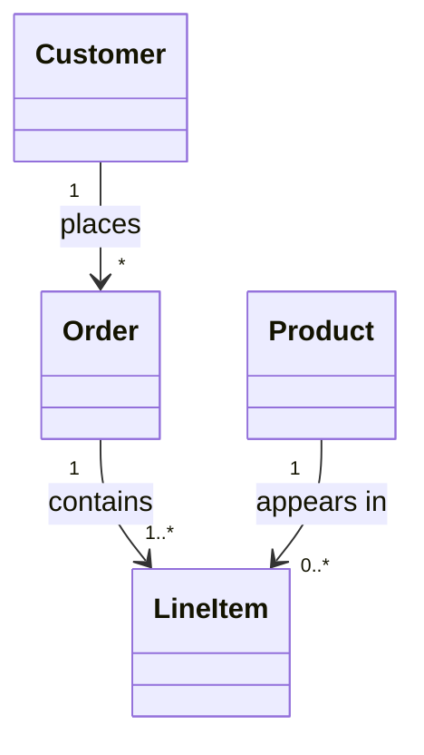

| Notation | Meaning |
|----------|---------|
| `1` | Exactly one |
| `0..1` | Zero or one |
| `*` | Zero or more |
| `1..*` | One or more |
| `n..m` | Range (n to m) |

## Relationship Labels

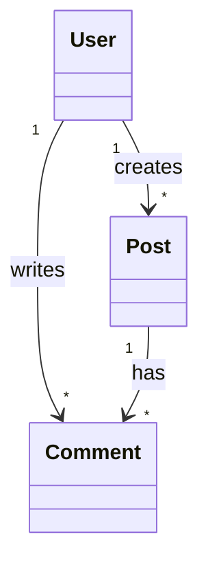

## Namespaces

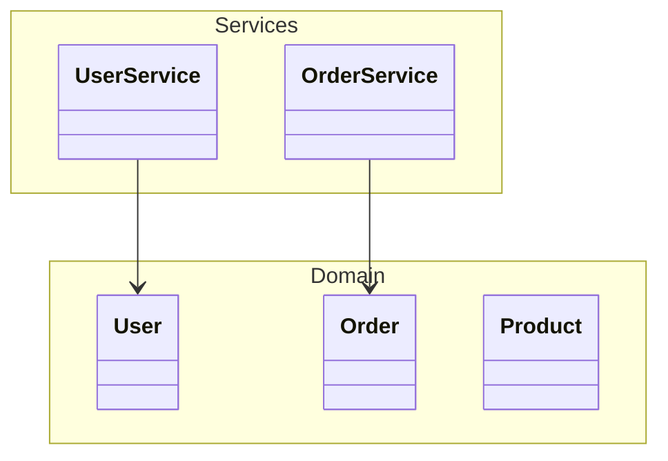

## Common Patterns

### Repository Pattern

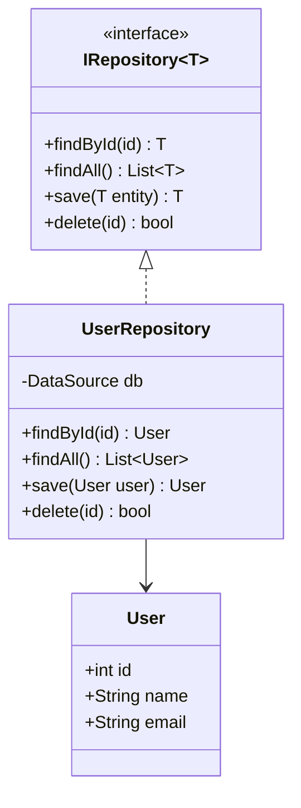

### Factory Pattern

```mermaid
classDiagram
  class VehicleFactory {
    <<abstract>>
    +createVehicle()* Vehicle
  }

  class CarFactory {
    +createVehicle() Vehicle
  }

  class BikeFactory {
    +createVehicle() Vehicle
  }

  class Vehicle {
    <<interface>>
    +start()
    +stop()
  }

  class Car {
    +start()
    +stop()
    +openTrunk()
  }

  class Bike {
    +start()
    +stop()
    +ringBell()
  }

  VehicleFactory <|-- CarFactory
  VehicleFactory <|-- BikeFactory
  Vehicle <|.. Car
  Vehicle <|.. Bike
  CarFactory ..> Car : creates
  BikeFactory ..> Bike : creates
```

### Service Layer

```mermaid
classDiagram
  class UserController {
    -UserService service
    +getUser(id) Response
    +createUser(data) Response
  }

  class UserService {
    -UserRepository repo
    -PasswordEncoder encoder
    +findById(id) User
    +create(UserDTO dto) User
  }

  class UserRepository {
    -DataSource db
    +findById(id) User
    +save(User user) User
  }

  UserController --> UserService
  UserService --> UserRepository
  UserService --> PasswordEncoder
```

### Domain Model

```mermaid
classDiagram
  class Order {
    +int id
    +Date createdAt
    +OrderStatus status
    +addItem(Product, qty)
    +removeItem(Product)
    +calculateTotal() Money
  }

  class OrderItem {
    +Product product
    +int quantity
    +Money unitPrice
    +subtotal() Money
  }

  class Product {
    +int id
    +String name
    +Money price
    +String description
  }

  class Customer {
    +int id
    +String name
    +String email
    +List~Order~ orders
  }

  Order "1" *-- "*" OrderItem
  OrderItem --> Product
  Customer "1" --> "*" Order
```

## Rendering

```typescript
import { renderMermaid, THEMES } from 'beautiful-mermaid'

const classDiagram = `
classDiagram
  class Animal {
    +String name
    +makeSound()
  }
  Animal <|-- Dog
  Animal <|-- Cat
`

// SVG output
const svg = await renderMermaid(classDiagram, THEMES['github-light'])

// ASCII output
import { renderMermaidAscii } from 'beautiful-mermaid'
const ascii = renderMermaidAscii(classDiagram)
```

## Tips

1. **Use visibility modifiers**: Always mark public/private/protected
2. **Show key relationships**: Don't clutter with every dependency
3. **Group by namespace**: Organize related classes together
4. **Add annotations**: Mark interfaces, abstracts, enums clearly
5. **Include cardinality**: Shows important constraints
6. **Keep methods concise**: Show signatures, not implementations
