# mermaid-er

Expert skill for Entity-Relationship diagrams with beautiful-mermaid.

## When to Use

- "ER diagram", "database schema", "entity relationship", "data model"
- Visualizing database tables, foreign keys, relationships
- Documenting data architecture, schema design

## Basic Syntax

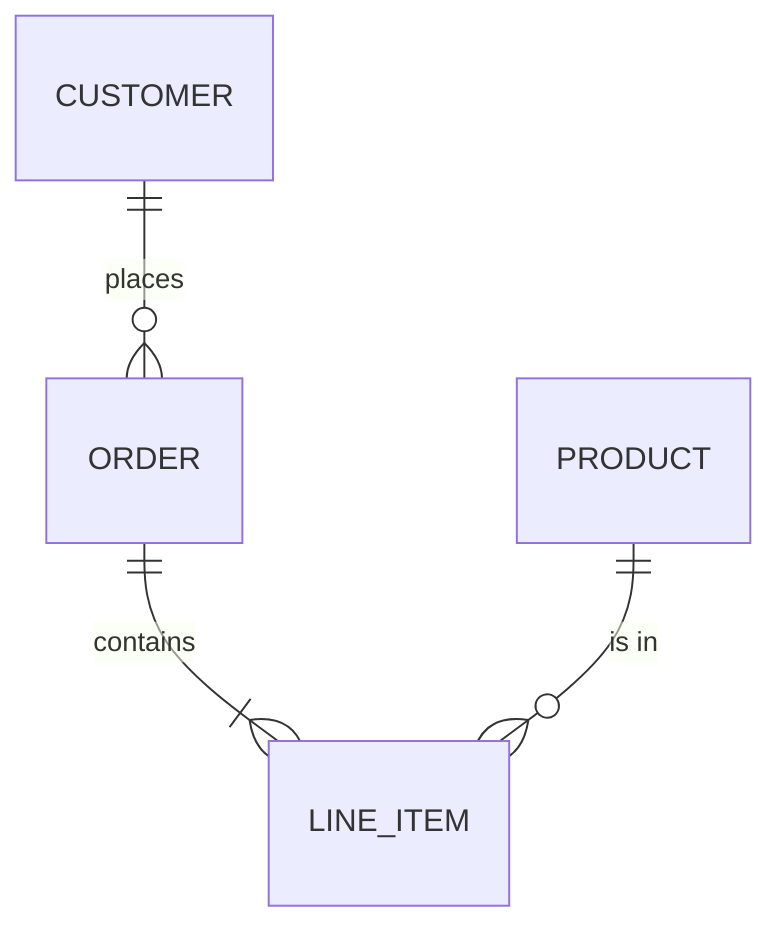

## Entities

### Simple Entity

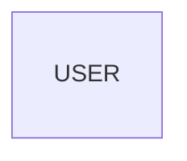

### Entity with Attributes

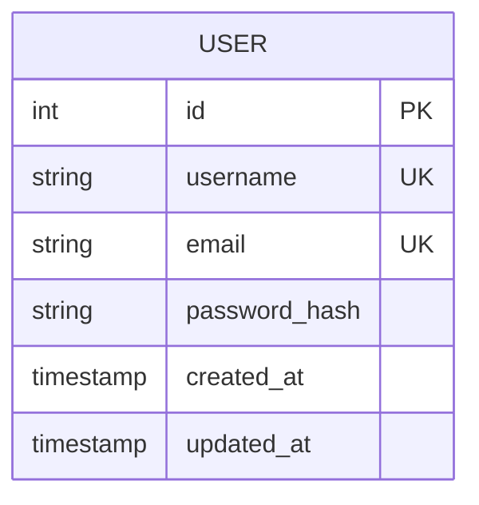

### Attribute Types

Common types (any string works):

| Type | Description |
|------|-------------|
| `int` | Integer |
| `bigint` | Large integer |
| `string` | Text/varchar |
| `text` | Long text |
| `float` | Decimal number |
| `boolean` | True/false |
| `date` | Date only |
| `timestamp` | Date and time |
| `json` | JSON data |
| `uuid` | UUID |

### Attribute Keys

| Key | Meaning |
|-----|---------|
| `PK` | Primary Key |
| `FK` | Foreign Key |
| `UK` | Unique Key |

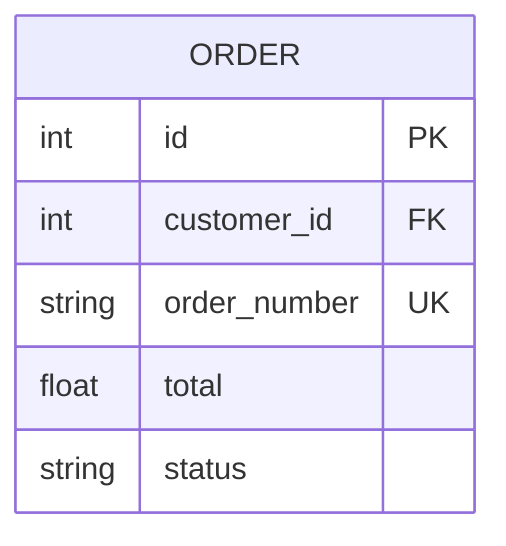

## Relationships

### Cardinality Notation (Crow's Foot)

| Left | Right | Meaning |
|------|-------|---------|
| `\|o` | `o\|` | Zero or one |
| `\|\|` | `\|\|` | Exactly one |
| `}o` | `o{` | Zero or more |
| `}\|` | `\|{` | One or more |

### Relationship Syntax

```
ENTITY1 <left><right> ENTITY2 : "label"
```

### One-to-One

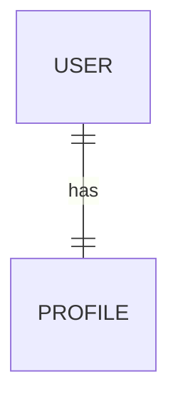

### One-to-Many

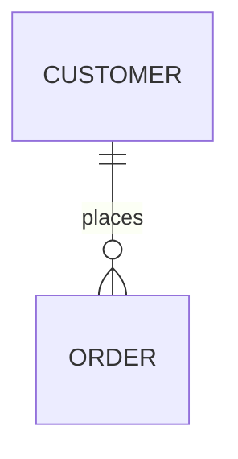

### Many-to-Many (via junction table)

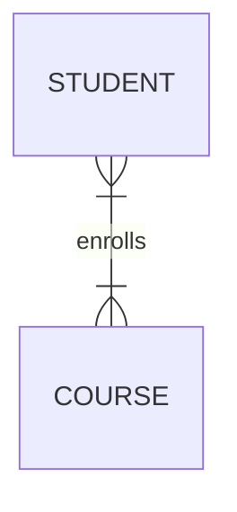

Or explicitly with junction:

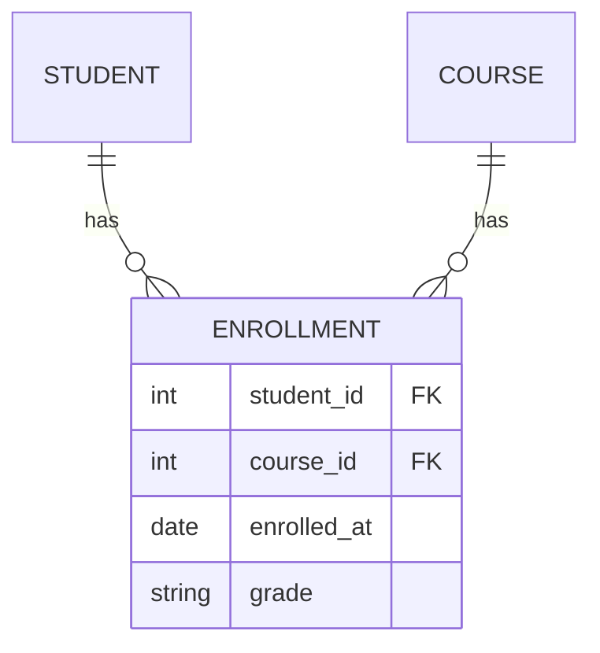

### Optional vs Required

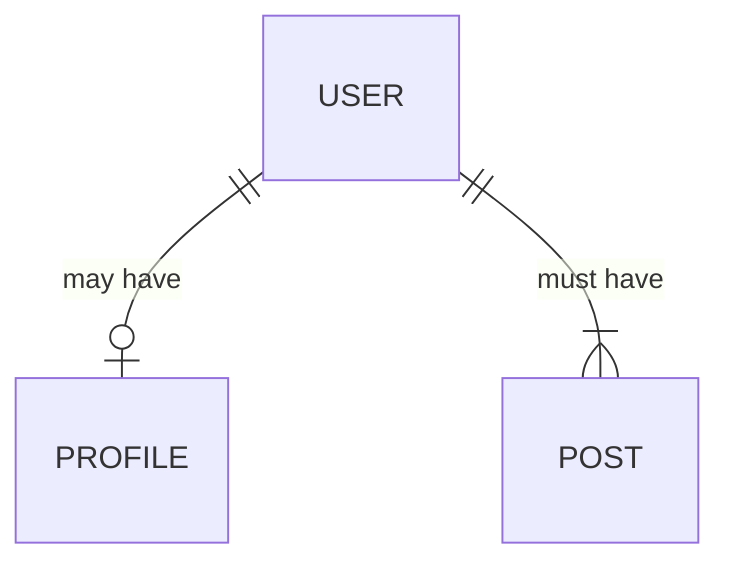

- `o` = Optional (zero)
- `|` = Required (one)

## Relationship Labels

Labels describe the relationship:

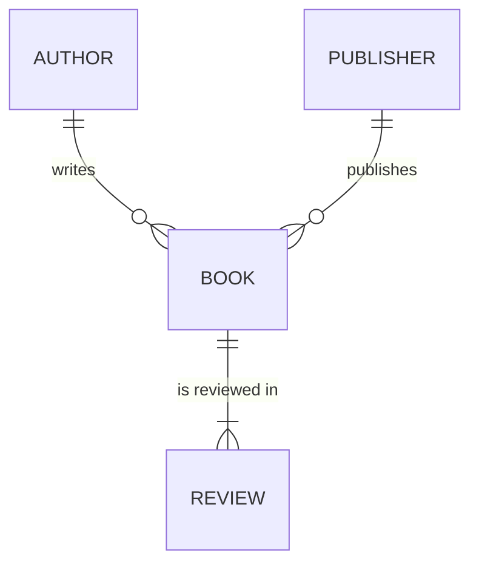

## Common Patterns

### E-Commerce Schema

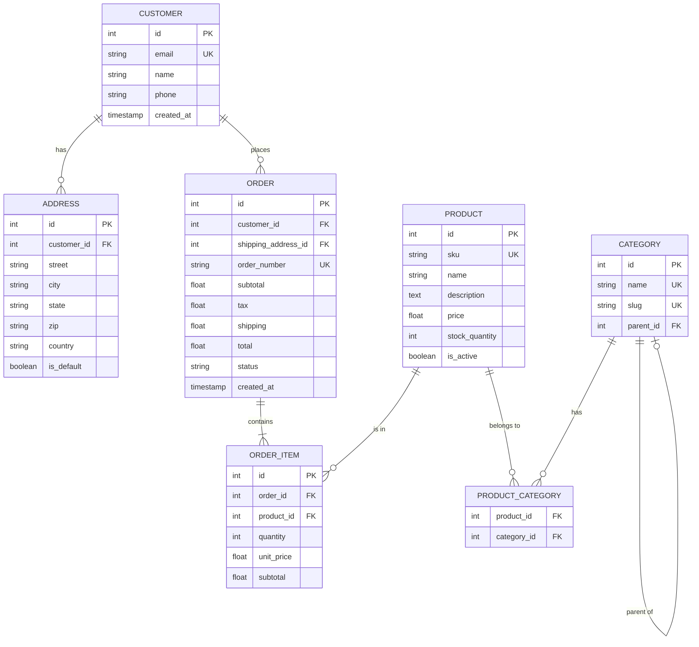

### Blog/CMS Schema

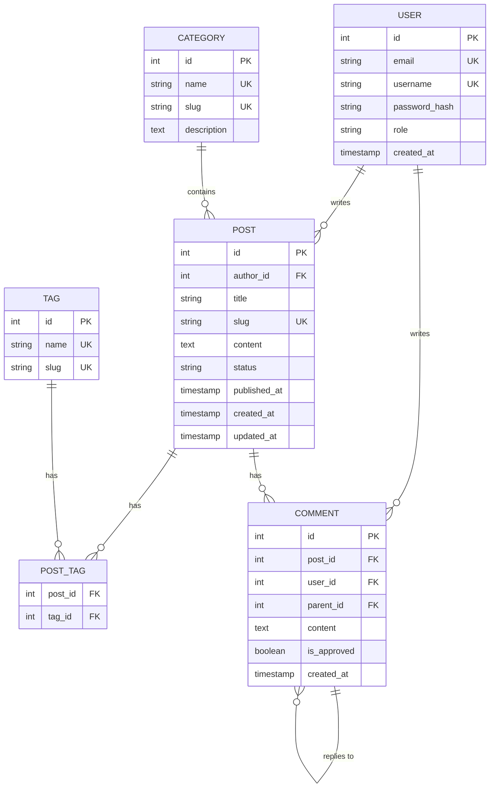

### SaaS Multi-tenant

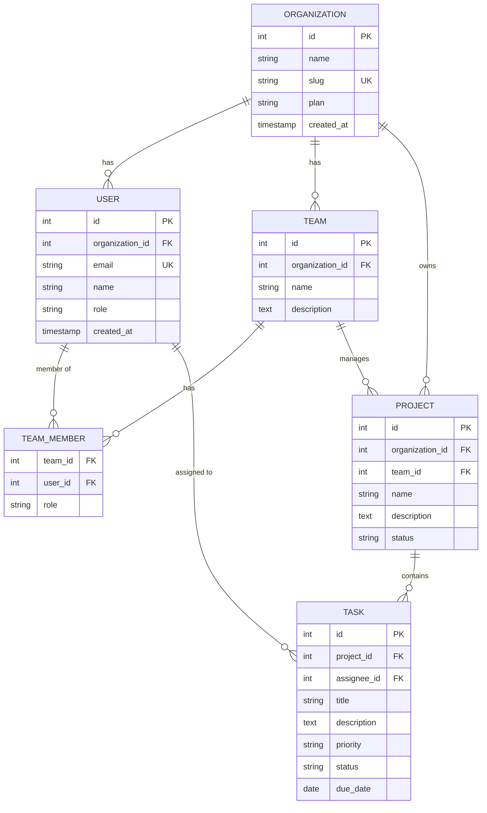

### Auth/Permissions

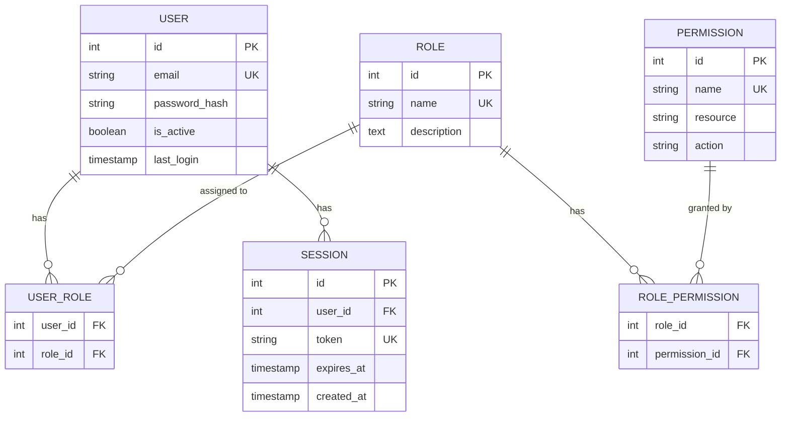

## Rendering

```typescript
import { renderMermaid, THEMES } from 'beautiful-mermaid'

const erDiagram = `
erDiagram
  CUSTOMER ||--o{ ORDER : places
  ORDER ||--|{ LINE_ITEM : contains
  PRODUCT ||--o{ LINE_ITEM : "is in"
`

// SVG output
const svg = await renderMermaid(erDiagram, THEMES['nord'])

// ASCII output
import { renderMermaidAscii } from 'beautiful-mermaid'
const ascii = renderMermaidAscii(erDiagram)
```

## Best Practices

1. **Use singular names**: `USER` not `USERS`
2. **Include key types**: Mark PK, FK, UK explicitly
3. **Show data types**: Helps communicate constraints
4. **Label relationships**: Verbs describe the connection
5. **Group related entities**: Keep the diagram readable
6. **Show junction tables**: Make many-to-many explicit
7. **Include timestamps**: `created_at`, `updated_at` are common

## Cardinality Quick Reference

| Symbol | Meaning |
|--------|---------|
| `\|\|` | Exactly one (required) |
| `\|o` | Zero or one (optional) |
| `\|{` | One or more (required many) |
| `o{` | Zero or more (optional many) |
