# mermaid-flowchart

Expert skill for flowcharts and state diagrams with beautiful-mermaid.

## When to Use

- "flowchart", "state diagram", "process flow", "decision tree"
- Visualizing algorithms, user flows, business processes
- Need subgraphs, custom shapes, or complex edge routing

## Basic Syntax

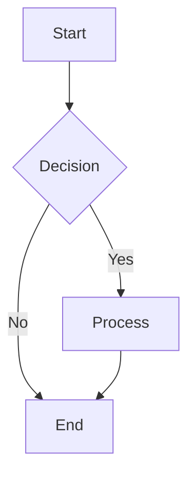

## Directions

| Keyword | Direction |
|---------|-----------|
| `TD` / `TB` | Top to Bottom |
| `BT` | Bottom to Top |
| `LR` | Left to Right |
| `RL` | Right to Left |

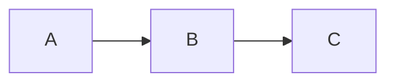

## Node Shapes (12 Types)

### Rectangle (Default)
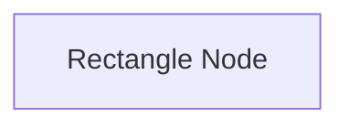

### Rounded Rectangle
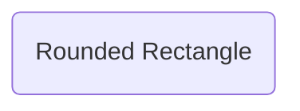

### Stadium / Pill
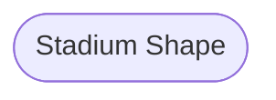

### Diamond (Decision)
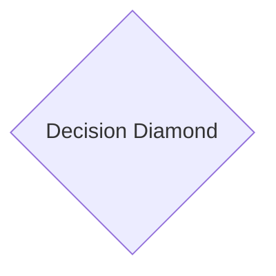

### Hexagon
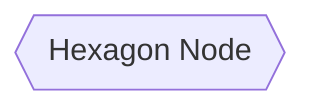

### Parallelogram
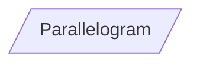

### Trapezoid
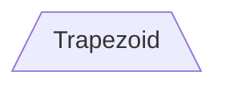

### Inverse Trapezoid
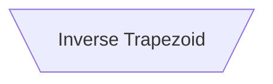

### Circle
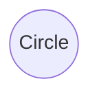

### Double Circle (Terminal)
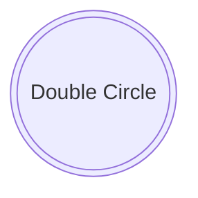

### Cylinder (Database)
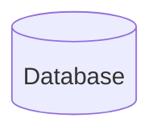

### Subroutine
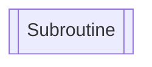

### Asymmetric (Flag)
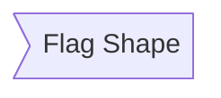

## Edge Styles

### Arrow Types

```mermaid
graph LR
  A --> B     %% Standard arrow
  C --- D     %% Line without arrow
  E -.-> F    %% Dotted arrow
  G ==> H     %% Thick arrow
  I --o J     %% Circle end
  K --x L     %% Cross end
  M <--> N    %% Bidirectional
```

### Edge Labels

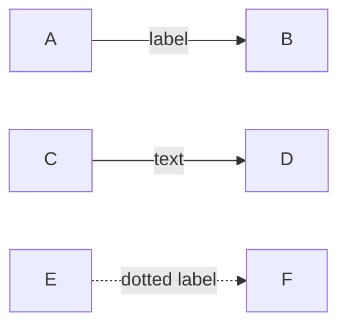

### Multi-Character Edges

```mermaid
graph LR
  A -----> B      %% Longer arrow
  C ======> D     %% Longer thick
  E -.....-> F    %% Longer dotted
```

## Subgraphs

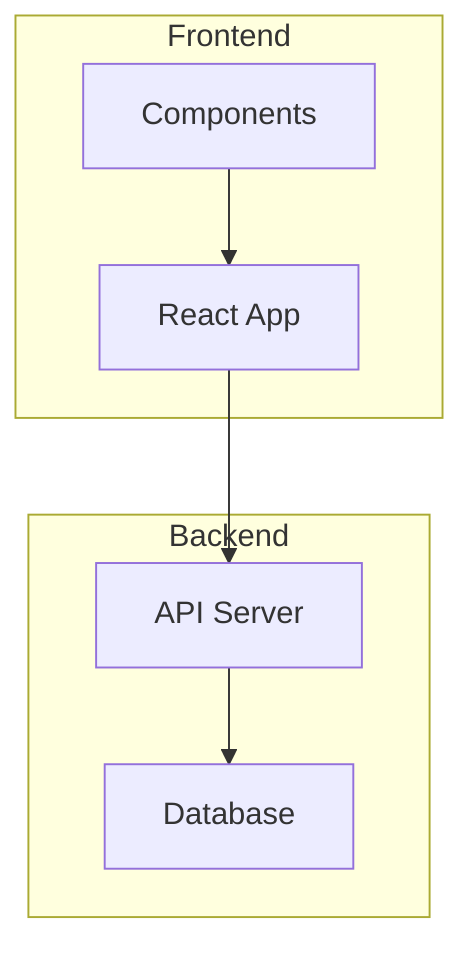

### Nested Subgraphs

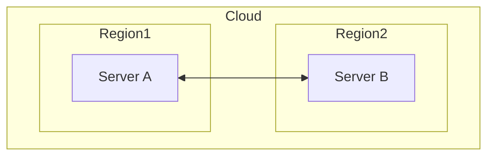

### Subgraph Direction

```mermaid
graph LR
  subgraph sub1[Left to Right]
    direction LR
    A --> B
  end
  subgraph sub2[Top to Bottom]
    direction TB
    C --> D
  end
```

## State Diagrams

```mermaid
stateDiagram-v2
  [*] --> Idle
  Idle --> Processing: start
  Processing --> Complete: done
  Processing --> Error: fail
  Error --> Idle: retry
  Complete --> [*]
```

### State with Description

```mermaid
stateDiagram-v2
  state "Waiting for input" as Waiting
  state "Processing request" as Processing

  [*] --> Waiting
  Waiting --> Processing: submit
  Processing --> Waiting: complete
```

### Composite States

```mermaid
stateDiagram-v2
  [*] --> Active

  state Active {
    [*] --> Idle
    Idle --> Running: start
    Running --> Idle: stop
  }

  Active --> [*]: shutdown
```

### Concurrent States (Fork/Join)

```mermaid
stateDiagram-v2
  [*] --> fork_state
  fork_state --> State2
  fork_state --> State3

  state fork_state <<fork>>

  State2 --> join_state
  State3 --> join_state

  state join_state <<join>>

  join_state --> State4
  State4 --> [*]
```

## Styling

### Class Definitions

```mermaid
graph TD
  A[Critical]:::critical --> B[Warning]:::warning --> C[Success]:::success

  classDef critical fill:#ff6b6b,stroke:#c92a2a,color:white
  classDef warning fill:#ffd93d,stroke:#f59f00,color:black
  classDef success fill:#69db7c,stroke:#2f9e44,color:white
```

### Link Styles

```mermaid
graph LR
  A --> B --> C
  linkStyle 0 stroke:red,stroke-width:2px
  linkStyle 1 stroke:blue,stroke-dasharray:5
```

## Common Patterns

### Decision Tree

```mermaid
graph TD
  Start[Start] --> Q1{Is it working?}
  Q1 -->|Yes| Done[Great!]
  Q1 -->|No| Q2{Did you try turning it off and on?}
  Q2 -->|Yes| Q3{Is it plugged in?}
  Q2 -->|No| TryRestart[Try restarting]
  TryRestart --> Q1
  Q3 -->|Yes| CallSupport[Call support]
  Q3 -->|No| PlugIn[Plug it in]
  PlugIn --> Q1
```

### User Flow

```mermaid
graph LR
  Landing[Landing Page] --> Login{Logged in?}
  Login -->|Yes| Dashboard[Dashboard]
  Login -->|No| Auth[Login/Signup]
  Auth --> Dashboard
  Dashboard --> Profile[Profile]
  Dashboard --> Settings[Settings]
  Dashboard --> Logout[Logout]
  Logout --> Landing
```

### System Architecture

```mermaid
graph TB
  subgraph Client
    Browser[Browser]
    Mobile[Mobile App]
  end

  subgraph LoadBalancer
    LB[Nginx]
  end

  subgraph Services
    API[API Server]
    Auth[Auth Service]
    Cache[(Redis)]
  end

  subgraph Data
    DB[(PostgreSQL)]
    S3[S3 Storage]
  end

  Browser --> LB
  Mobile --> LB
  LB --> API
  API --> Auth
  API --> Cache
  API --> DB
  API --> S3
```

## Rendering

```typescript
import { renderMermaid, THEMES } from 'beautiful-mermaid'

const flowchart = `
graph TD
  A[Start] --> B{Check}
  B -->|Pass| C[Continue]
  B -->|Fail| D[Retry]
  D --> B
  C --> E[End]
`

// SVG output
const svg = await renderMermaid(flowchart, THEMES['tokyo-night'])

// ASCII output
import { renderMermaidAscii } from 'beautiful-mermaid'
const ascii = renderMermaidAscii(flowchart)
```

## Tips

1. **Use meaningful IDs**: `A[User Login]` instead of `A[Step 1]`
2. **Group related nodes**: Use subgraphs for logical sections
3. **Keep labels short**: Long labels break layout
4. **Direction matters**: LR for timelines, TD for hierarchies
5. **Limit depth**: Max 3-4 levels of nesting for readability
