# Node Shapes Reference

Visual reference for all 12+ node shapes in beautiful-mermaid flowcharts.

## Shape Syntax

| Shape | Syntax | Visual |
|-------|--------|--------|
| Rectangle | `A[Text]` | `┌────┐` |
| Rounded | `A(Text)` | `╭────╮` |
| Stadium | `A([Text])` | `(════)` |
| Diamond | `A{Text}` | `◇` |
| Hexagon | `A{{Text}}` | `⬡` |
| Parallelogram | `A[/Text/]` | `/═══/` |
| Trapezoid | `A[/Text\]` | `/═══\` |
| Inv. Trapezoid | `A[\Text/]` | `\═══/` |
| Circle | `A((Text))` | `○` |
| Double Circle | `A(((Text)))` | `◎` |
| Cylinder | `A[(Text)]` | `⌸` |
| Subroutine | `A[[Text]]` | `║═══║` |
| Flag | `A>Text]` | `▷═══│` |

## Detailed Examples

### Rectangle (Default)
Standard rectangular node. Best for general processes.

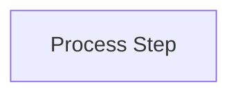

```
┌──────────────┐
│ Process Step │
└──────────────┘
```

### Rounded Rectangle
Softer appearance. Good for start/end or user-facing steps.

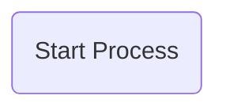

```
╭────────────────╮
│ Start Process  │
╰────────────────╯
```

### Stadium / Pill
Pill-shaped node. Great for labels, tags, or categories.

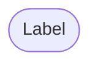

```
(═══════)
( Label )
(═══════)
```

### Diamond (Decision)
Classic decision/branching node.

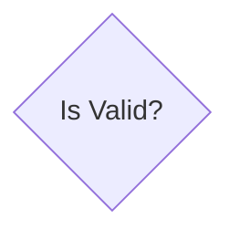

```
    ◇
   / \
  /   \
 │Valid?│
  \   /
   \ /
    ◇
```

### Hexagon
Six-sided node. Good for preparation or setup steps.

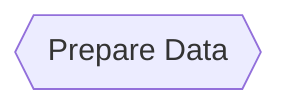

```
  ╱──────────╲
 /            \
│ Prepare Data │
 \            /
  ╲──────────╱
```

### Parallelogram
Input/Output operations (traditional flowchart symbol).

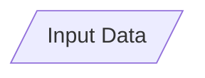

```
  ╱──────────╱
 / Input Data /
╱──────────╱
```

### Trapezoid
Manual operation or wider-at-top process.

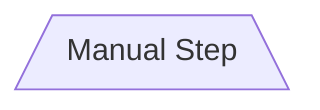

```
╱────────────────╲
│   Manual Step   │
╲────────────────╱
```

### Inverse Trapezoid
Narrower at top, good for funneling or filtering.

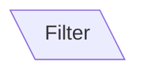

```
╲────────────────╱
│     Filter     │
╱────────────────╲
```

### Circle
Simple circular node. Good for events or states.

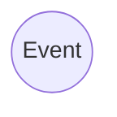

```
  ╭─────╮
 (       )
 ( Event )
 (       )
  ╰─────╯
```

### Double Circle
Terminal/final state (from state machine notation).

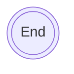

```
  ╭──────╮
 (( ╭──╮ ))
 (( │End│ ))
 (( ╰──╯ ))
  ╰──────╯
```

### Cylinder
Database or storage. Traditional data store symbol.

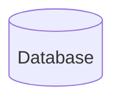

```
  ╭────────╮
  ╰────────╯
  │        │
  │Database│
  │        │
  ╰────────╯
```

### Subroutine
Predefined process or function call.

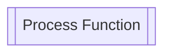

```
║═══════════════════║
║ Process Function  ║
║═══════════════════║
```

### Flag / Asymmetric
Asymmetric shape. Good for events or signals.

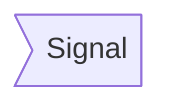

```
▷═══════════│
│   Signal  │
▷═══════════│
```

## Shape Usage Guidelines

| Use Case | Recommended Shape |
|----------|-------------------|
| Process step | Rectangle `[]` |
| Start/End | Rounded `()` or Stadium `([])` |
| Decision | Diamond `{}` |
| Input/Output | Parallelogram `[/ /]` |
| Database | Cylinder `[()]` |
| Function call | Subroutine `[[]]` |
| Event/State | Circle `(())` |
| Terminal state | Double Circle `((()))` |
| Preparation | Hexagon `{{}}` |
| Manual process | Trapezoid `[/ \]` |

## Combining Shapes

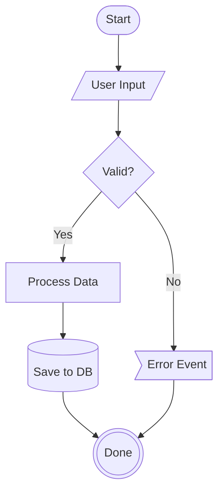

## ASCII Rendering

Shapes render with box-drawing characters:

```
┌──────┐     ╭──────╮     ┌──────┐
│Rect  │     │Round │     │◇Dec │
└──────┘     ╰──────╯     └──────┘
```

Note: Complex shapes (hexagon, trapezoid) render as rectangles in ASCII mode.

## Tips

1. **Be consistent**: Use the same shape for the same type of step
2. **Don't overuse**: 3-4 different shapes per diagram max
3. **Follow conventions**: Diamond for decisions, cylinder for databases
4. **Consider ASCII**: Not all shapes render in terminal output
5. **Label clearly**: Shape + clear text = easy understanding
