# mermaid-sequence

Expert skill for sequence diagrams with beautiful-mermaid.

## When to Use

- "sequence diagram", "message flow", "API interaction", "protocol"
- Visualizing service communication, webhooks, request/response patterns
- Documenting API calls, microservice interactions, or event flows

## Basic Syntax

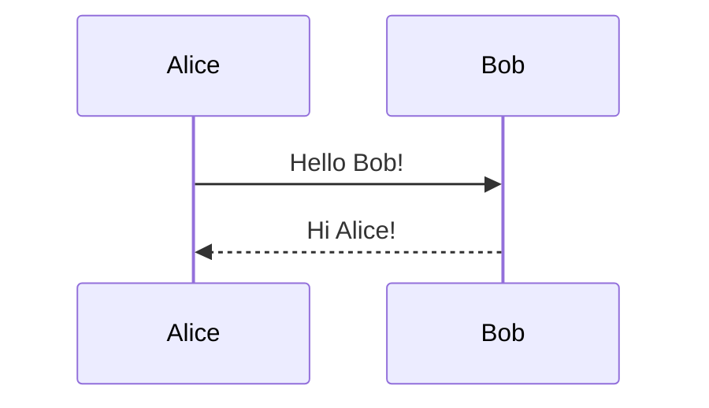
```mermaid
sequenceDiagram
  Alice->>Bob: Hello Bob!
  Bob-->>Alice: Hi Alice!
```

## Participants

### Implicit Declaration

Participants are created automatically when first used:

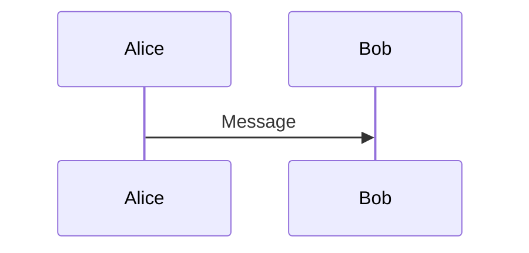
```mermaid
sequenceDiagram
  Alice->>Bob: Message
```

### Explicit Declaration

Control order and use aliases:

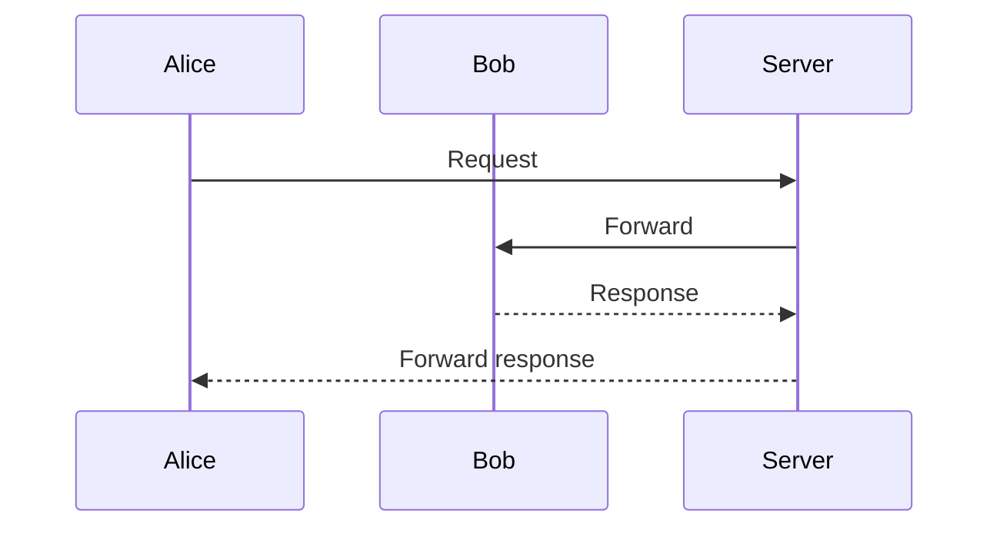
```mermaid
sequenceDiagram
  participant A as Alice
  participant B as Bob
  participant S as Server

  A->>S: Request
  S->>B: Forward
  B-->>S: Response
  S-->>A: Forward response
```

### Actors (Stick Figures)

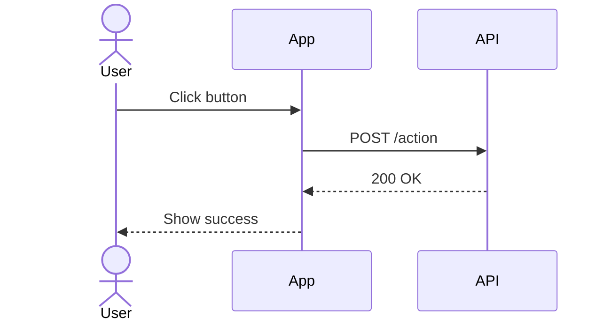
```mermaid
sequenceDiagram
  actor User
  participant App
  participant API

  User->>App: Click button
  App->>API: POST /action
  API-->>App: 200 OK
  App-->>User: Show success
```

## Message Types

### Arrow Styles

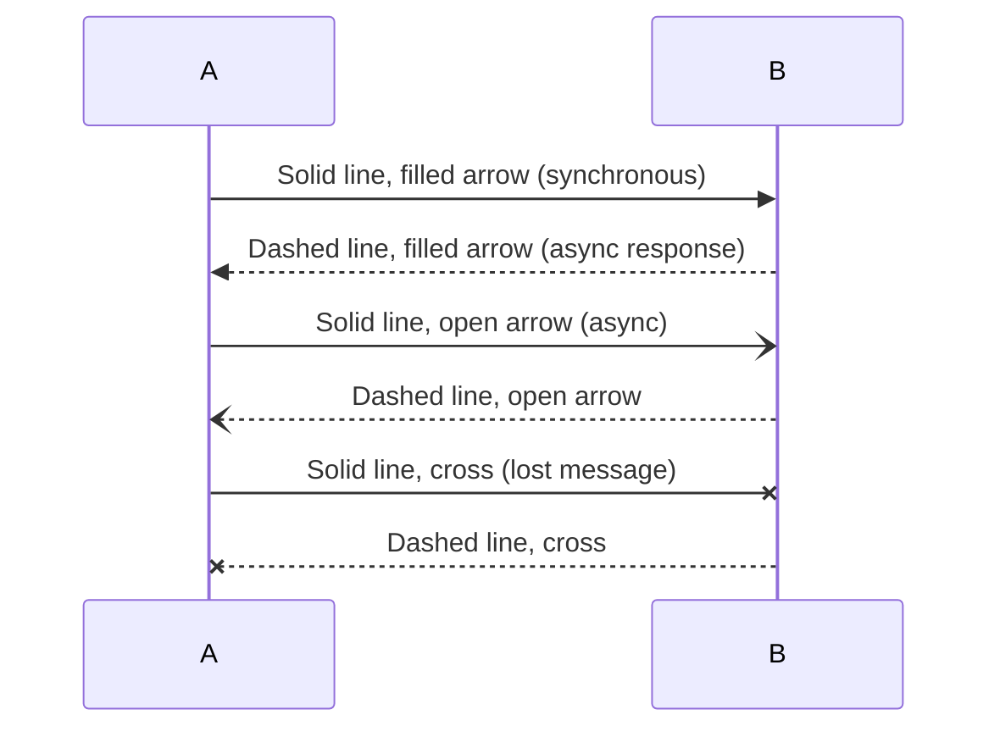
```mermaid
sequenceDiagram
  A->>B: Solid line, filled arrow (synchronous)
  B-->>A: Dashed line, filled arrow (async response)
  A-)B: Solid line, open arrow (async)
  B--)A: Dashed line, open arrow
  A-xB: Solid line, cross (lost message)
  B--xA: Dashed line, cross
```

| Syntax | Description |
|--------|-------------|
| `->>` | Solid line, filled arrowhead (sync call) |
| `-->>` | Dashed line, filled arrowhead (response) |
| `-)` | Solid line, open arrowhead (async) |
| `--)` | Dashed line, open arrowhead |
| `-x` | Solid line with cross (lost/dropped) |
| `--x` | Dashed line with cross |

### Self-Messages (Reflexive)

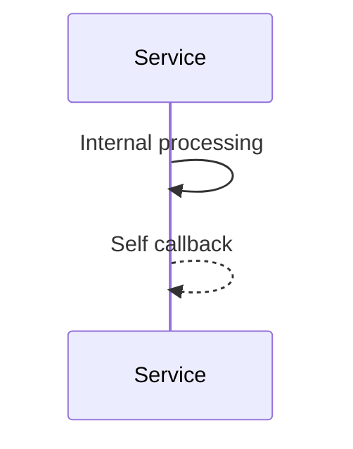
```mermaid
sequenceDiagram
  participant Service

  Service->>Service: Internal processing
  Service-->>Service: Self callback
```

## Activation Boxes

Show when a participant is active/processing:

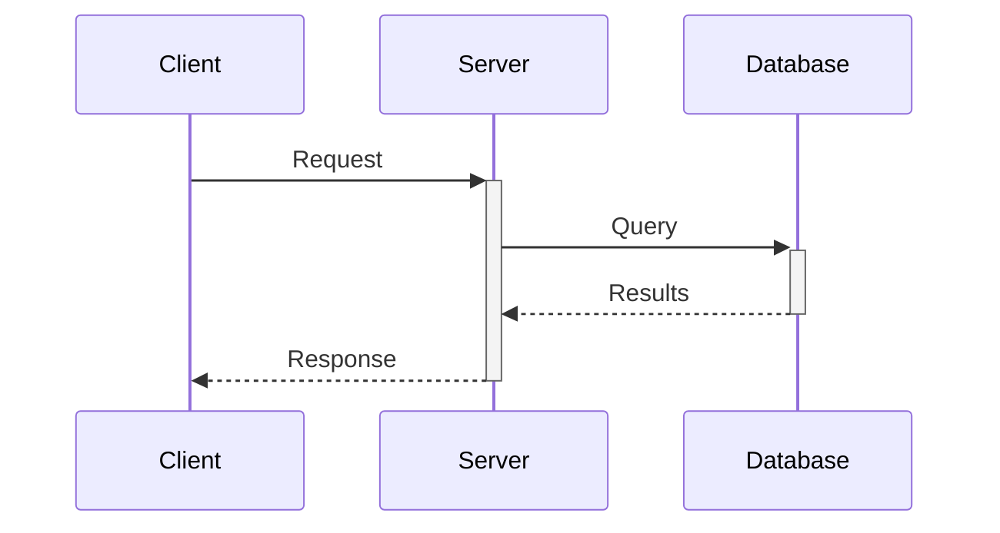
```mermaid
sequenceDiagram
  Client->>+Server: Request
  Server->>+Database: Query
  Database-->>-Server: Results
  Server-->>-Client: Response
```

### Explicit Activation

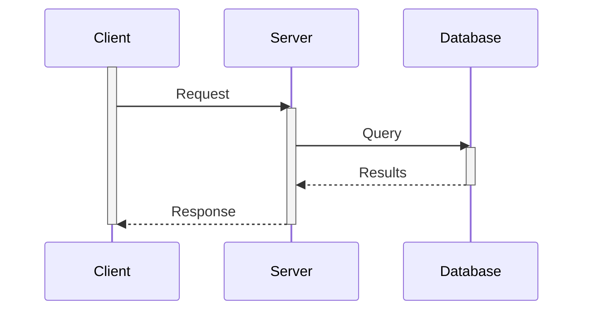
```mermaid
sequenceDiagram
  activate Client
  Client->>Server: Request
  activate Server
  Server->>Database: Query
  activate Database
  Database-->>Server: Results
  deactivate Database
  Server-->>Client: Response
  deactivate Server
  deactivate Client
```

### Nested Activation

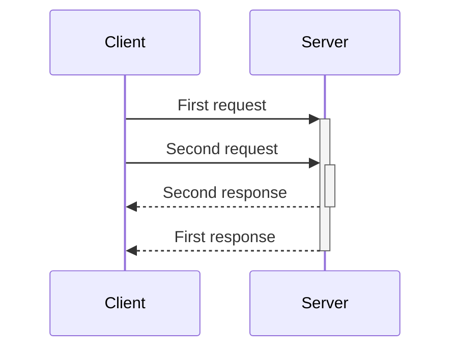
```mermaid
sequenceDiagram
  Client->>+Server: First request
  Client->>+Server: Second request
  Server-->>-Client: Second response
  Server-->>-Client: First response
```

## Notes

### Note Positioning

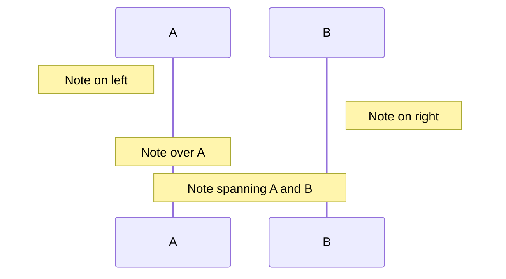
```mermaid
sequenceDiagram
  participant A
  participant B

  Note left of A: Note on left
  Note right of B: Note on right
  Note over A: Note over A
  Note over A,B: Note spanning A and B
```

### Multi-line Notes

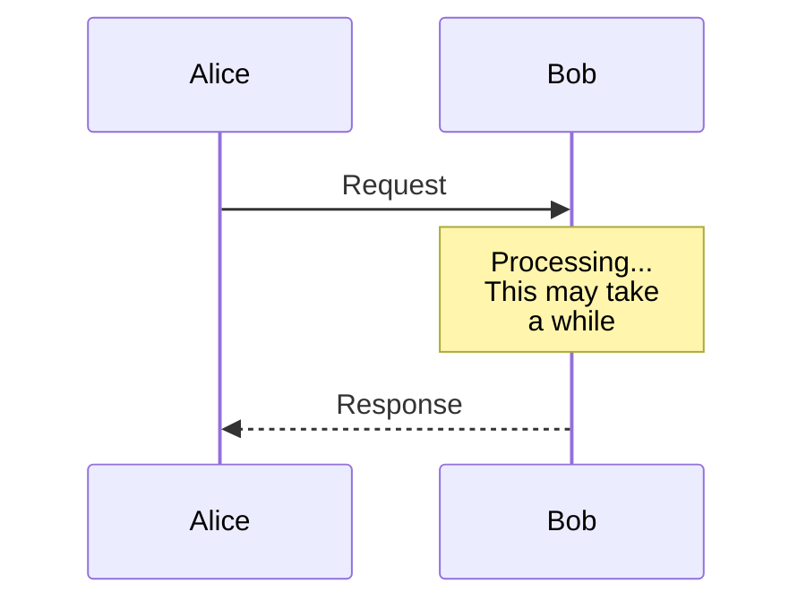
```mermaid
sequenceDiagram
  Alice->>Bob: Request
  Note over Bob: Processing...<br/>This may take<br/>a while
  Bob-->>Alice: Response
```

## Blocks

### Loop

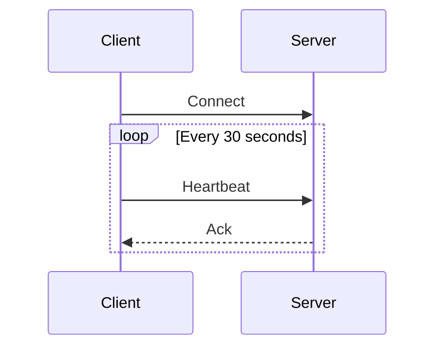
```mermaid
sequenceDiagram
  Client->>Server: Connect
  loop Every 30 seconds
    Client->>Server: Heartbeat
    Server-->>Client: Ack
  end
```

### Alt (If/Else)

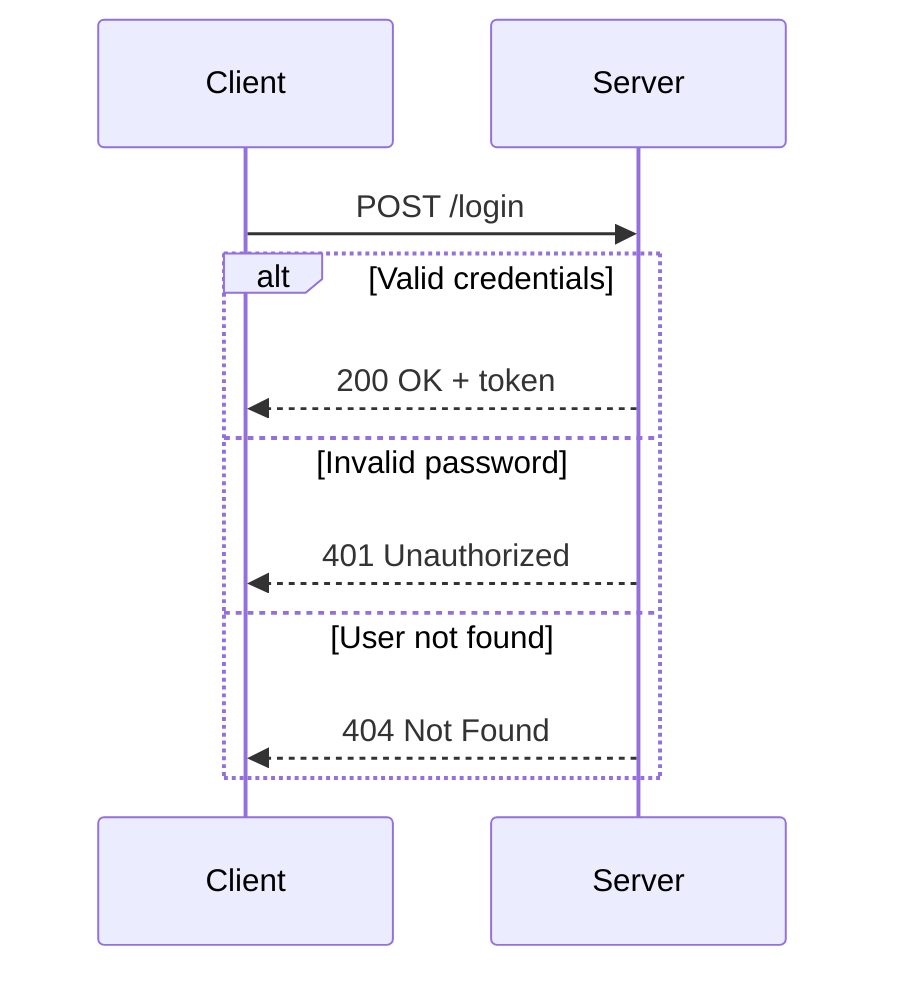
```mermaid
sequenceDiagram
  Client->>Server: POST /login

  alt Valid credentials
    Server-->>Client: 200 OK + token
  else Invalid password
    Server-->>Client: 401 Unauthorized
  else User not found
    Server-->>Client: 404 Not Found
  end
```

### Opt (Optional)

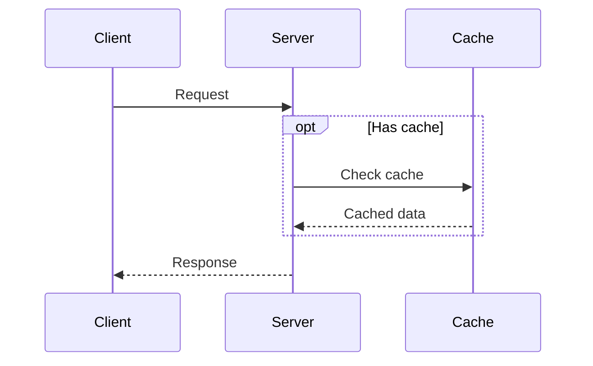
```mermaid
sequenceDiagram
  Client->>Server: Request
  opt Has cache
    Server->>Cache: Check cache
    Cache-->>Server: Cached data
  end
  Server-->>Client: Response
```

### Par (Parallel)

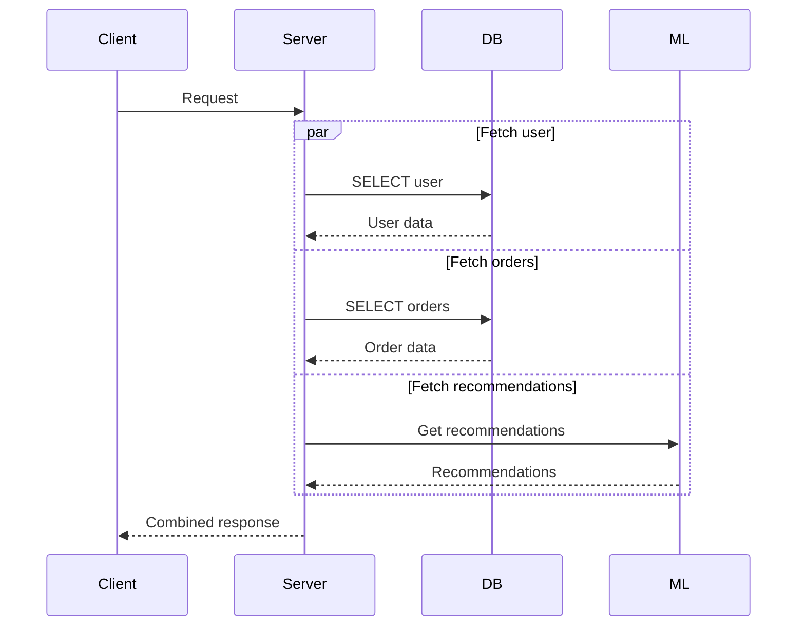
```mermaid
sequenceDiagram
  Client->>Server: Request

  par Fetch user
    Server->>DB: SELECT user
    DB-->>Server: User data
  and Fetch orders
    Server->>DB: SELECT orders
    DB-->>Server: Order data
  and Fetch recommendations
    Server->>ML: Get recommendations
    ML-->>Server: Recommendations
  end

  Server-->>Client: Combined response
```

### Critical

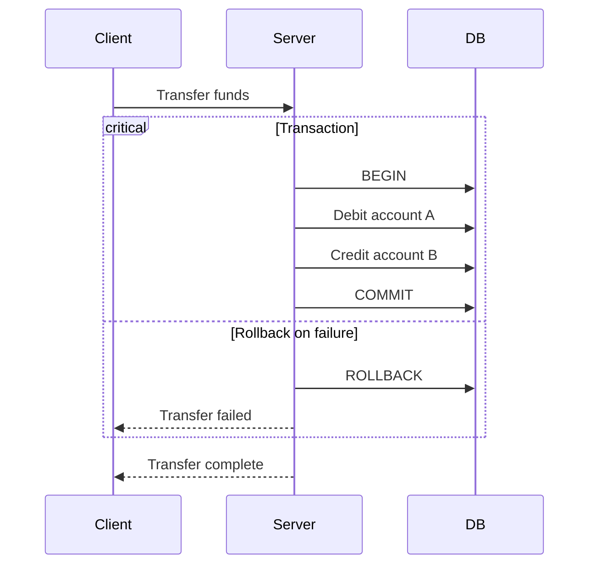
```mermaid
sequenceDiagram
  Client->>Server: Transfer funds

  critical Transaction
    Server->>DB: BEGIN
    Server->>DB: Debit account A
    Server->>DB: Credit account B
    Server->>DB: COMMIT
  option Rollback on failure
    Server->>DB: ROLLBACK
    Server-->>Client: Transfer failed
  end

  Server-->>Client: Transfer complete
```

### Break

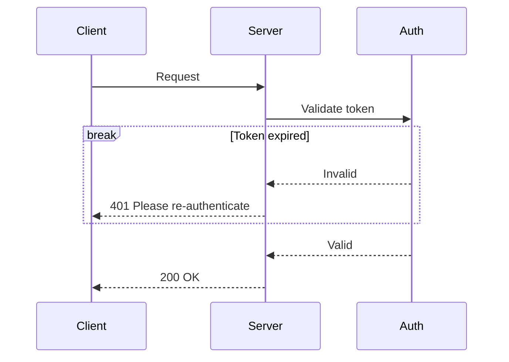
```mermaid
sequenceDiagram
  Client->>Server: Request
  Server->>Auth: Validate token

  break Token expired
    Auth-->>Server: Invalid
    Server-->>Client: 401 Please re-authenticate
  end

  Auth-->>Server: Valid
  Server-->>Client: 200 OK
```

### Rect (Highlighting)

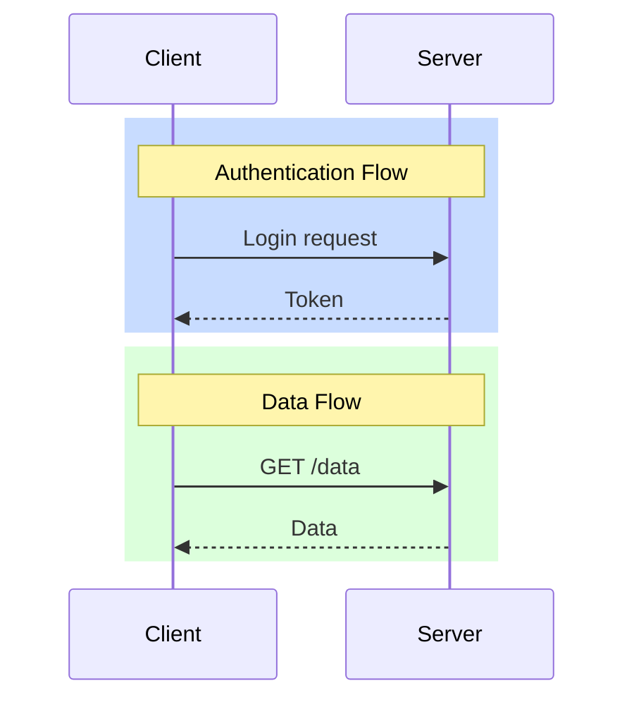
```mermaid
sequenceDiagram
  rect rgb(200, 220, 255)
    Note over Client,Server: Authentication Flow
    Client->>Server: Login request
    Server-->>Client: Token
  end

  rect rgb(220, 255, 220)
    Note over Client,Server: Data Flow
    Client->>Server: GET /data
    Server-->>Client: Data
  end
```

## Sequence Numbers

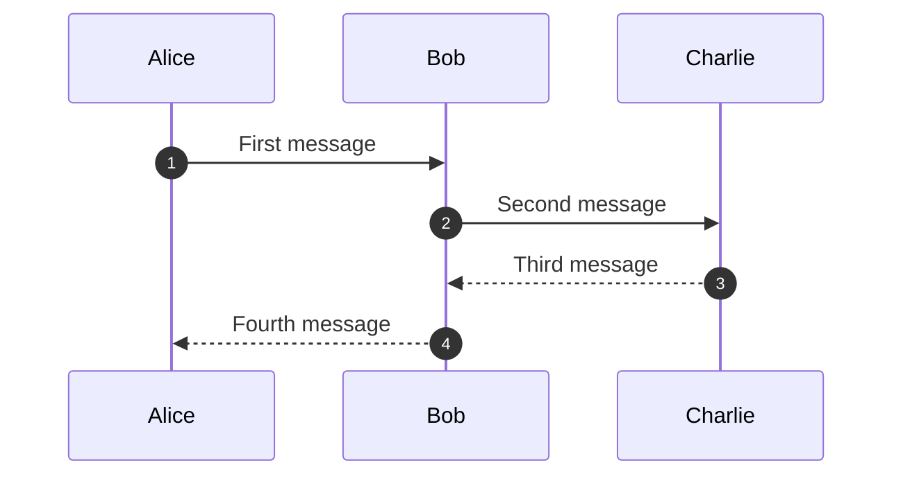
```mermaid
sequenceDiagram
  autonumber
  Alice->>Bob: First message
  Bob->>Charlie: Second message
  Charlie-->>Bob: Third message
  Bob-->>Alice: Fourth message
```

## Common Patterns

### REST API Call

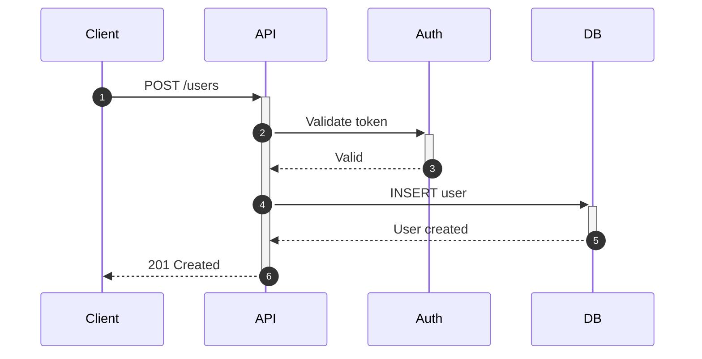
```mermaid
sequenceDiagram
  autonumber
  participant Client
  participant API
  participant Auth
  participant DB

  Client->>+API: POST /users
  API->>+Auth: Validate token
  Auth-->>-API: Valid
  API->>+DB: INSERT user
  DB-->>-API: User created
  API-->>-Client: 201 Created
```

### OAuth2 Flow

```mermaid
sequenceDiagram
  participant User
  participant App
  participant Auth as Auth Server
  participant API as Resource Server

  User->>App: Click "Login with OAuth"
  App->>Auth: Redirect to /authorize
  Auth->>User: Show login page
  User->>Auth: Enter credentials
  Auth->>App: Redirect with auth code
  App->>Auth: Exchange code for token
  Auth-->>App: Access token + refresh token
  App->>API: Request with access token
  API-->>App: Protected resource
  App-->>User: Show data
```

### Webhook Flow

```mermaid
sequenceDiagram
  participant User
  participant App
  participant Service
  participant Webhook as Webhook Handler

  User->>App: Initiate action
  App->>Service: Start async process
  Service-->>App: 202 Accepted
  App-->>User: Processing started

  Note over Service: Processing...

  Service-)Webhook: POST /webhook (event)
  Webhook->>App: Update status
  App-)User: Push notification
```

### Microservices

```mermaid
sequenceDiagram
  participant Gateway
  participant Users
  participant Orders
  participant Inventory
  participant Notifications

  Gateway->>+Users: Validate user
  Users-->>-Gateway: User valid

  par Create order
    Gateway->>+Orders: Create order
    Orders->>+Inventory: Reserve items
    Inventory-->>-Orders: Reserved
    Orders-->>-Gateway: Order created
  and Send notification
    Gateway-)Notifications: Order placed
  end

  Gateway-->>User: Order confirmation
```

## Rendering

```typescript
import { renderMermaid, THEMES } from 'beautiful-mermaid'

const sequence = `
sequenceDiagram
  autonumber
  Client->>+Server: Request
  Server->>+DB: Query
  DB-->>-Server: Data
  Server-->>-Client: Response
`

// SVG output
const svg = await renderMermaid(sequence, THEMES['catppuccin-mocha'])

// ASCII output
import { renderMermaidAscii } from 'beautiful-mermaid'
const ascii = renderMermaidAscii(sequence)
```

## Tips

1. **Use aliases**: `participant A as Alice` for cleaner diagrams
2. **Show activation**: Use `+`/`-` to show processing time
3. **Group with blocks**: Use `rect` to highlight sections
4. **Add numbers**: `autonumber` helps trace flow
5. **Keep it focused**: One sequence per interaction, not entire system
6. **Use notes**: Explain complex logic inline
