# Mermaid Syntax Guide

Complete syntax reference for all diagram types supported by beautiful-mermaid.

## Flowcharts

### Declaration

```mermaid
graph TD      %% or flowchart TD
  ...
```

### Directions

| Keyword | Direction |
|---------|-----------|
| `TD` / `TB` | Top to Bottom |
| `BT` | Bottom to Top |
| `LR` | Left to Right |
| `RL` | Right to Left |

### Node Shapes

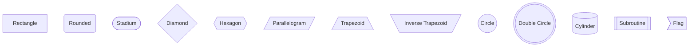

### Edge Types

```mermaid
graph LR
  A --> B       %% Arrow
  C --- D       %% Line
  E -.-> F      %% Dotted arrow
  G ==> H       %% Thick arrow
  I --o J       %% Circle end
  K --x L       %% Cross end
  M <--> N      %% Bidirectional
  O -- text --> P   %% With label
  Q -->|label| R    %% Label syntax
```

### Edge Length

```mermaid
graph LR
  A --> B       %% Normal
  C ---> D      %% Longer
  E ----> F     %% Even longer
```

### Subgraphs

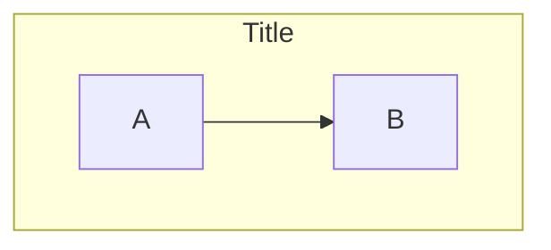

### Styling

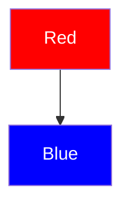

---

## Sequence Diagrams

### Declaration

```mermaid
sequenceDiagram
  ...
```

### Participants

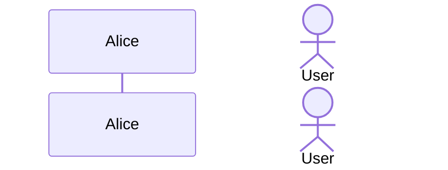

### Messages

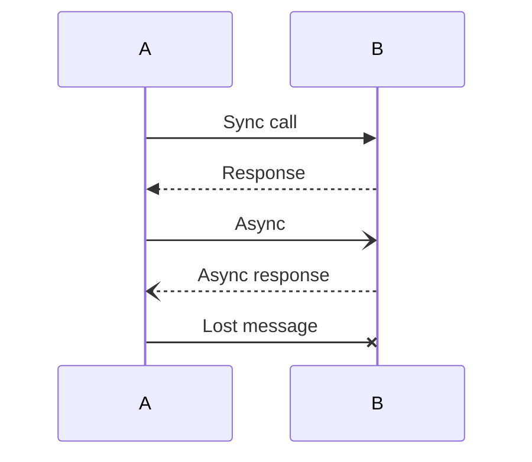

### Activation

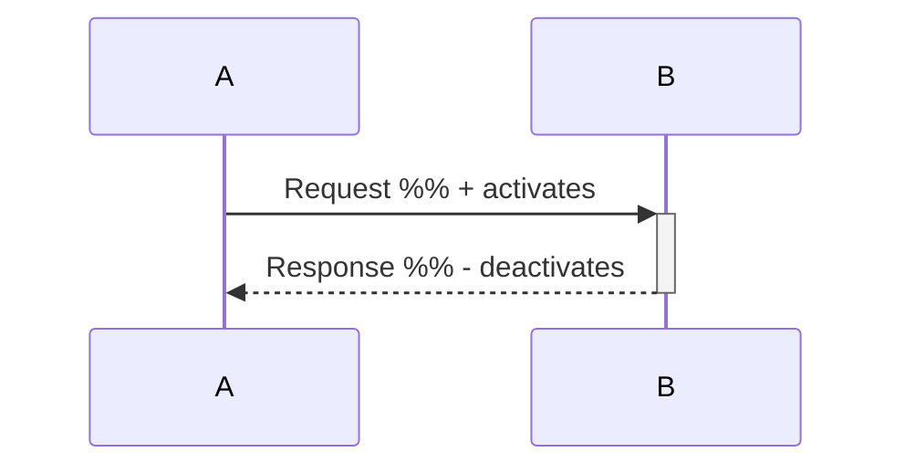

### Notes

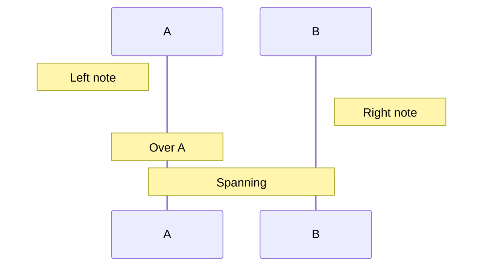

### Blocks

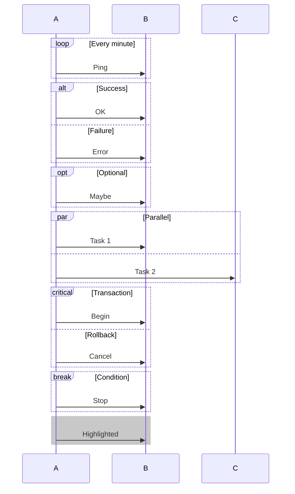

### Autonumber

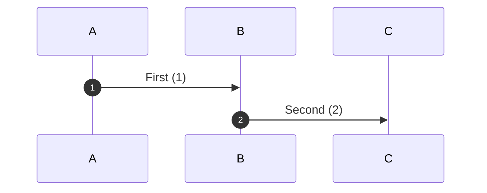

---

## Class Diagrams

### Declaration

```mermaid
classDiagram
  ...
```

### Classes

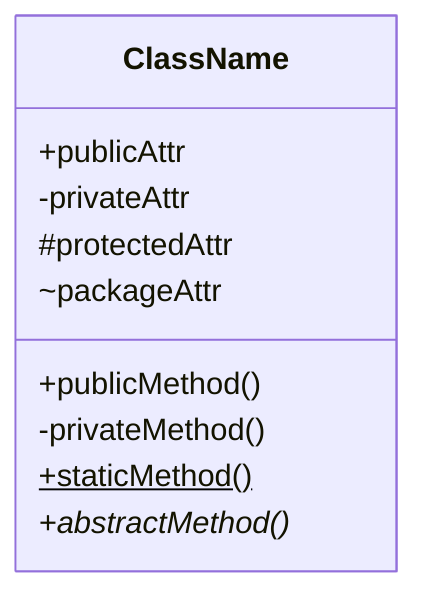

### Generics

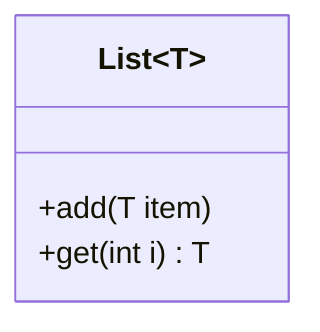

### Annotations

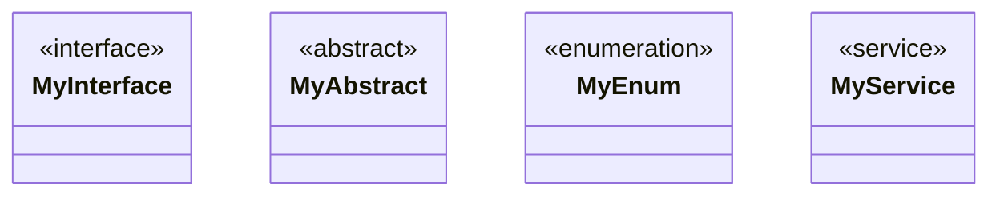

### Relationships

```mermaid
classDiagram
  A <|-- B      %% Inheritance
  C <|.. D      %% Implementation
  E *-- F       %% Composition
  G o-- H       %% Aggregation
  I --> J       %% Association
  K ..> L       %% Dependency
  M -- N        %% Link
```

### Cardinality

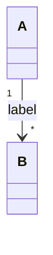

| Notation | Meaning |
|----------|---------|
| `1` | Exactly one |
| `0..1` | Zero or one |
| `*` | Zero or more |
| `1..*` | One or more |

### Namespaces

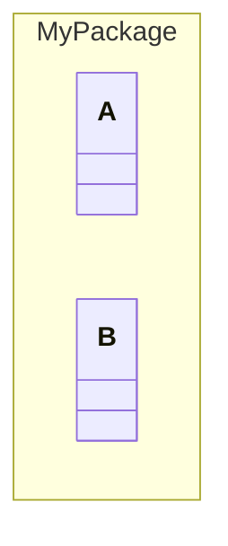

---

## ER Diagrams

### Declaration

```mermaid
erDiagram
  ...
```

### Entities

```mermaid
erDiagram
  ENTITY {
    type name PK
    type name FK
    type name UK
  }
```

### Relationships

```mermaid
erDiagram
  A ||--|| B : "one-to-one"
  C ||--o{ D : "one-to-many"
  E }|--|{ F : "many-to-many"
```

### Cardinality Symbols

| Left | Right | Meaning |
|------|-------|---------|
| `\|o` | `o\|` | Zero or one |
| `\|\|` | `\|\|` | Exactly one |
| `}o` | `o{` | Zero or more |
| `}\|` | `\|{` | One or more |

---

## State Diagrams

### Declaration

```mermaid
stateDiagram-v2
  ...
```

### States

```mermaid
stateDiagram-v2
  [*] --> State1          %% Initial
  State1 --> State2       %% Transition
  State2 --> [*]          %% Final

  state "Long Name" as S  %% Alias
```

### Transitions

```mermaid
stateDiagram-v2
  A --> B: event
  B --> C: guard [condition]
```

### Composite States

```mermaid
stateDiagram-v2
  state Parent {
    [*] --> Child1
    Child1 --> Child2
  }
```

### Fork/Join

```mermaid
stateDiagram-v2
  state fork <<fork>>
  state join <<join>>

  [*] --> fork
  fork --> A
  fork --> B
  A --> join
  B --> join
  join --> [*]
```

### Choice

```mermaid
stateDiagram-v2
  state choice <<choice>>

  [*] --> choice
  choice --> A: if yes
  choice --> B: if no
```

### Notes

```mermaid
stateDiagram-v2
  State1
  note right of State1
    This is a note
  end note
```

---

## Comments

All diagram types support comments:

```mermaid
graph TD
  %% This is a comment
  A --> B  %% Inline comment
```

---

## Special Characters

Escape special characters in labels:

```mermaid
graph TD
  A["Label with (parentheses)"]
  B["Label with {braces}"]
  C["Label with [brackets]"]
```

Use HTML entities:

```mermaid
graph TD
  A["Greater &gt; Less &lt;"]
  B["Ampersand &amp;"]
```

---

## Line Breaks

Use `<br>` or `<br/>` for line breaks:

```mermaid
graph TD
  A["Line 1<br>Line 2<br>Line 3"]
```

---

## Links and Tooltips

```mermaid
graph TD
  A[Link] --> B[Tooltip]
  click A "https://example.com" "Open example"
  click B callback "Tooltip text"
```

---

## Quick Reference

| Diagram | Keyword | Example |
|---------|---------|---------|
| Flowchart | `graph`, `flowchart` | `graph TD` |
| Sequence | `sequenceDiagram` | `sequenceDiagram` |
| Class | `classDiagram` | `classDiagram` |
| ER | `erDiagram` | `erDiagram` |
| State | `stateDiagram-v2` | `stateDiagram-v2` |
